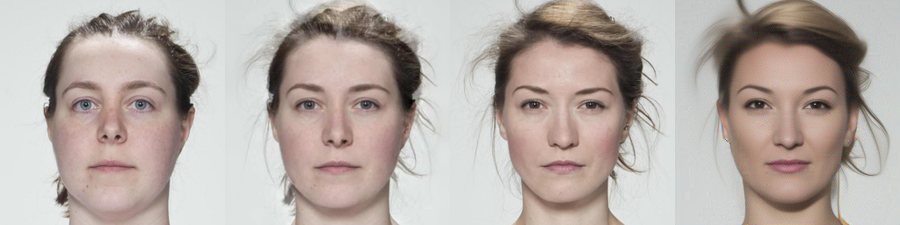

# A brief overview of DIFFAE-FD
A TIFS 2024 paper 《Face De-Morphing Based on Diffusion Autoencoders》 ([paper](https://ieeexplore.ieee.org/stamp/stamp.jsp?tp=&arnumber=10415238)):

```
@ARTICLE{10415238,
  author={Long, Min and Yao, Quantao and Zhang, Le-Bing and Peng, Fei},
  journal={IEEE Transactions on Information Forensics and Security}, 
  title={Face De-Morphing Based on Diffusion Autoencoders}, 
  year={2024},
  volume={19},
  number={},
  pages={3051-3063},
  keywords={Feature extraction;Semantics;Faces;Image restoration;Face recognition;Codes;Stochastic processes;Face de-morphing;diffusion autoencoders;dual-branch identity separation network;semantic latent space;conditional denoising diffusion implicit model},
  doi={10.1109/TIFS.2024.3359029}}
```
# Datasets
Three datasets, namely HNU-FM, FRLL_Morphs, and SYN-MAD, were selected as experimental datasets in this article. Given that facial data involves privacy, it is advised that readers contact the authors themselves to download the dataset.

The format of the dataset file directory is as follows:
```
datasets/
- Protocol I # datasets
    - train  # train datasets
        -real # real facial images
        -whole  # morphed facial images
    - dev # dev datasets
        -real # real facial images
        -whole # morphed facial images
    - test # test datasets
        -real # real facial images
        -whole # morphed facial images
- Protocol III
    ...
- ...
```

# Checkpoints
This work opts for the DIFFAE (autoencoding only) FFHQ256 as the pre-trained diffusion autoencoder, and the storage location for checkpoints should be executed in accordance with the file outlined below:

```
checkpoints/
- ffhq256_autoenc
    - last.ckpt 
```

The trained separation network model is saved in the diffae_fd/pretrain_model directory

# De-morphing
The face de-morphing process mainly involves the following steps:
1. loading the facial images in the test datasets
2. loading the pre-trained weights of DIFFAE
3. loading the pre-trained weights of the dual-branch separation network
4. feed the reference facial image and the morphed facial image into the network, and the accomplice's facial image will be successfully restored
```
python demorphing.py
```

# Visualization Results of Experiment
The initial image is a reference facial image, followed by a morphed facial image as the second image. The third image portrays a genuine accomplice's facial image, whereas the fourth image exhibits a restored accomplice's facial image.

<table>
<tr>
<th width="100%">
Restored sample in <code>imgs</code> directory<br>
</th>
</tr>
</table>
